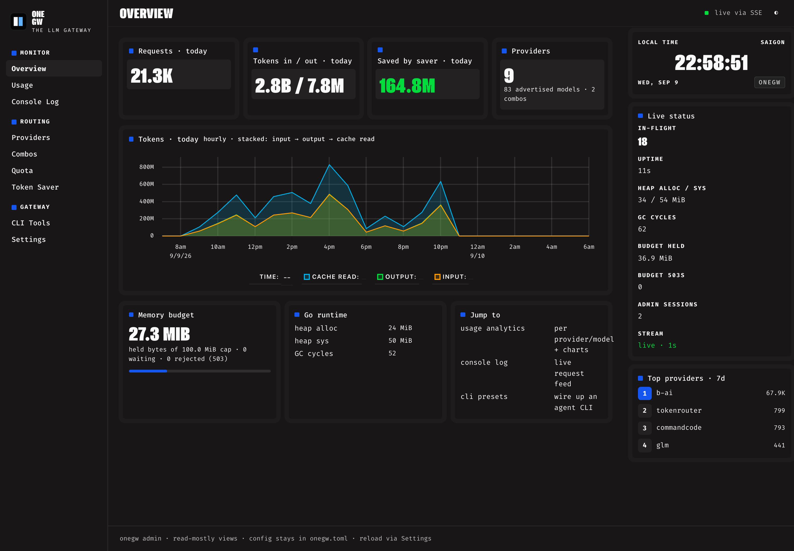
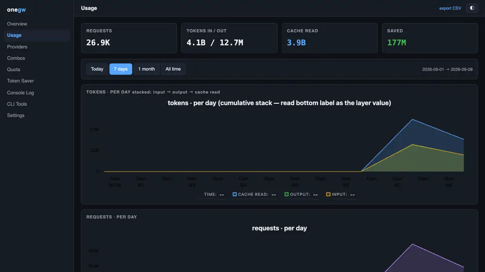
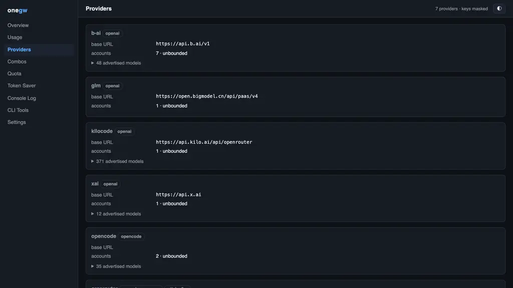
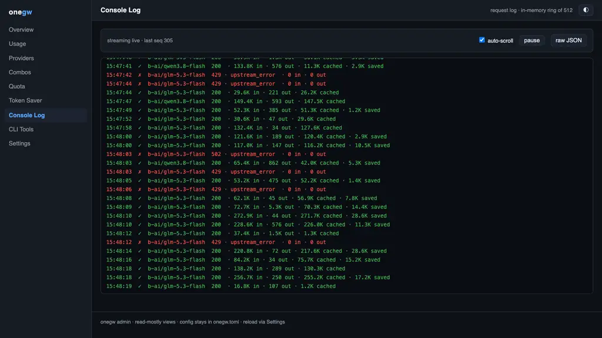
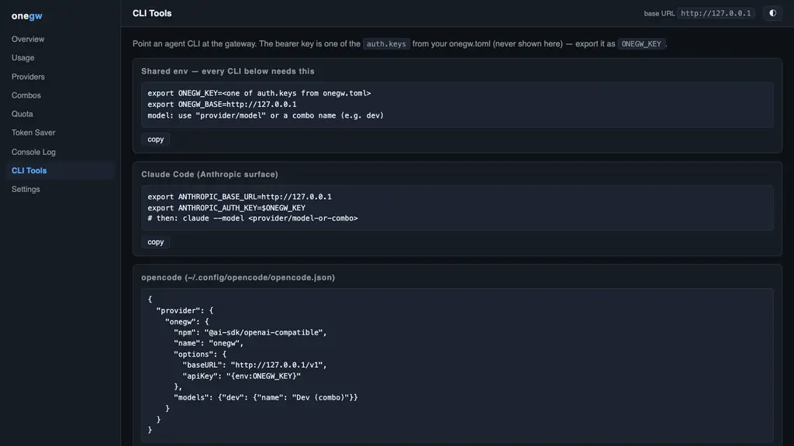
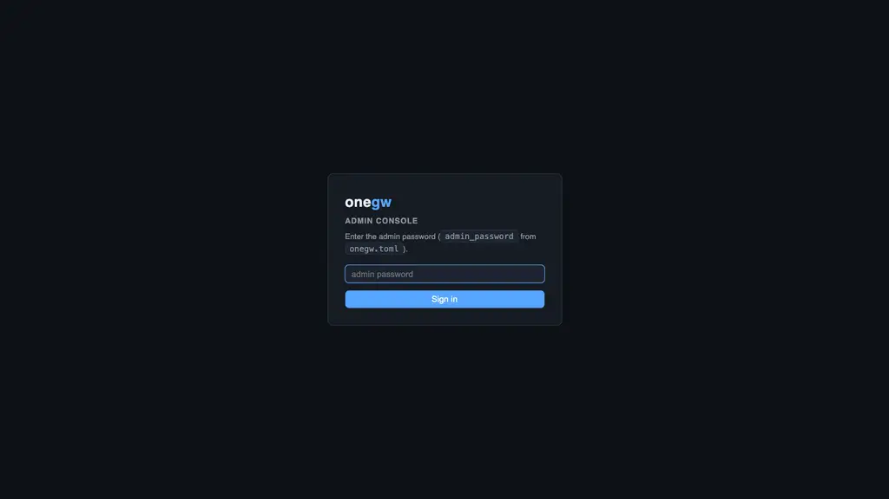

<div align="center">
  
</div>

# onegw

<div align="center">

[](https://go.dev)
[](LICENSE)
[](https://github.com/FreePeak/onegw)
[](#surfaces)
[](#surfaces)
[](#surfaces)
[](#surfaces)
[](#features)
[](#benchmarks)

</div>


**Single-binary LLM gateway in Go.** One process fronts OpenAI-, Anthropic-, and
Gemini-compatible providers behind any of those three API surfaces — with
cross-format translation, fallback routing, token saving, and usage tracking —
inside a ~100 MB RAM envelope.

A resource-efficient alternative to JavaScript gateways like
[9router](https://github.com/decolua/9router): no runtime, no per-request
buffering, no conversation state.

## Why onegw

| Concern | Typical Node/JS gateway | onegw |
| --- | --- | --- |
| Runtime | Node.js + framework | Single static Go binary (`CGO_ENABLED=0`) |
| Streaming | Parsed & re-serialized | Byte passthrough; cross-format streams re-encoded event-by-event |
| Sessions | Cached conversations | Stateless — memory is independent of session count |
| RAM | Hundreds of MB | **Measured: 17 MiB baseline → 67 MiB peak** under 30 concurrent 800 KB streams |
| Throughput target | — | 1–2 B tokens/day (~12–23 k tok/s sustained; bench hit ~71 K tok/s) |

## Features

- **Three wire surfaces, any-to-any translation.** OpenAI, Anthropic, and
  Gemini clients can all talk to all three upstream kinds — request bodies and
  SSE streams translated on the fly through a unified intermediate model.
- **Combos (fallback chains).** A model name can resolve to an ordered list of
  `{provider, model}` targets: retry on 429/5xx/network errors with backoff,
  fail fast on other 4xx, per-provider concurrency caps.
- **Account pools.** Multiple API keys per provider with weighted round-robin
  and quota cooldown.
- **Token saver (input + output).** Input side: RTK-style `tool_result`
  compression (prefix sniffing, idempotent, same-format surgical JSON walk)
  cuts prompt tokens before they reach the upstream. Output side: system-prompt
  injection of terse-output directives and an external compress hook (below).
- **OAuth device flows for subscription providers (#2).** `onegw-oauth
  login -provider xai` runs the RFC 8628 device flow (Kilo Code's bespoke
  dialect also built in), stores the token in
  `<data_dir>/oauth-tokens.json` (0600, atomic writes), and the gateway
  injects it as the upstream bearer credential at request time — with a
  per-account refresher that tops up the token before expiry (single-flight
  per account) and cools the account when a refresh fails.
- **Token saver.** RTK-style `tool_result` compression (prefix sniffing,
  idempotent, same-format surgical JSON walk) cuts prompt tokens before they
  reach the upstream.
- **Usage tracking.** Lock-sharded atomic counters flushed to SQLite on a
  timer; per `provider / model / key / day / hour` rollups; admin API and
  built-in dashboard.
- **Byte-budget backpressure.** The non-streaming cross-format path holds a
  4× body-size reservation against a 48 MiB global budget; saturation returns
  `503 + Retry-After` in the client's wire format instead of growing RSS.

## Quick start

### One command (macOS / Linux)

```bash
curl -fsSL https://raw.githubusercontent.com/FreePeak/onegw/master/scripts/install.sh | sh
```

Installs the latest release binary, writes a starter config (loopback bind,
generated admin password), and starts the gateway on 127.0.0.1:8080. It prints
the gateway key and dashboard password — set `ONEGW_LISTEN` or `ONEGW_KEYS`
to override. Config lives in `~/.onegw/onegw.toml`; add `[[providers]]` blocks
there (see [Configuration](#configuration)).

### One command (VPS / cloud, Docker)

```bash
docker run -d --name onegw --restart unless-stopped -p 8080:8080 \
  -e ONEGW_KEYS=change-me -v onegw-data:/data ghcr.io/freepeak/onegw:latest
```

Runs the non-root image (~40 MB, healthchecked) with usage data persisted in
the `onegw-data` volume. Pass provider keys as env, e.g.
`-e ONEGW_PROVIDER_OPENROUTER_KEY=sk-...`; or mount your own config with
`-v $PWD/onegw.toml:/etc/onegw/onegw.toml:ro`. For a compose setup with
resource limits, see [`docker-compose.yml`](docker-compose.yml):

```bash
docker compose up -d
```

### Build from source

```bash
go build -o onegw ./cmd/onegw
cp onegw.toml.example onegw.toml   # add provider keys
./onegw                            # listens on 127.0.0.1:8080 (loopback only)
```

### Updating

`onegw update` keeps a running gateway current with zero dropped requests:

```bash
onegw update            # check + apply (zero-drop handoff restart)
onegw update --check    # report only
onegw version           # what is running
```

The running gateway checks GitHub releases daily (default repo
`FreePeak/onegw`; `[update] check_interval` in `onegw.toml`, `0`/`off`
disables, `auto = true` applies without asking). Applying is done BY the
serving process: it downloads the platform asset (sha256-verified when
GitHub publishes a digest), smoke-runs it, atomically renames it over the
old binary (keeping a `.old` backup), starts the new build on the
SO_REUSEPORT listener, waits until the new process proves it owns the port
by answering `/admin/update` with its own pid, then drains the old pid.
Any failed step rolls back — the old gateway never stops serving.

`GET /admin/update` reports status (current/latest/pid/last check),
`POST /admin/update` forces a check, `POST /admin/update` with
`{"apply":true}` runs the handoff — same auth as the other admin
endpoints (`X-Admin-Password`).

Running in Docker? Self-update is deliberately disabled (the container
filesystem belongs to the image): the gateway still checks and logs newer
releases, and `onegw update` prints the host-side commands —
`docker pull ghcr.io/freepeak/onegw:<tag>` plus recreate
(`docker compose up -d` for compose). The `/data` volume keeps usage
history across the recreate.

Then point any OpenAI-, Anthropic-, or Gemini-compatible client at the
gateway. Examples with curl:

```bash
# OpenAI client → OpenAI upstream (passthrough)
curl http://127.0.0.1:8080/v1/chat/completions \
  -H "Authorization: Bearer $ONEGW_KEY" \
  -d '{"model":"openrouter/deepseek/deepseek-v3.2","messages":[{"role":"user","content":"hi"}]}'

# Anthropic client → OpenAI upstream (translated, streamed)
curl http://127.0.0.1:8080/v1/messages \
  -H "x-api-key: $ONEGW_KEY" -H "anthropic-version: 2023-06-01" \
  -d '{"model":"openrouter/deepseek/deepseek-v3.2","max_tokens":1024,"stream":true,"messages":[{"role":"user","content":"hi"}]}'

# Gemini client → Anthropic upstream (translated)
curl "http://127.0.0.1:8080/v1beta/models/anthropic/claude-sonnet-4-5:generateContent?alt=sse" \
  -H "x-goog-api-key: $ONEGW_KEY" \
  -d '{"contents":[{"role":"user","parts":[{"text":"hi"}]}]}'
```

Use a combo name as the model to get an ordered fallback chain
(`"model": "coding-stack"`).

## Dashboard

The built-in admin console lives at `http://127.0.0.1:8080/admin` — sign in
with `admin_password` from your config (a 12-hour HttpOnly cookie; the
`X-Admin-Password` header keeps working for scripts). Fully server-rendered
Go `html/template` + htmx + uPlot, vendored inline: zero external assets, no
CDN, no Node toolchain — the console ships inside the single binary.



**Overview** — today's request/token/saver totals, the byte-budget meter
(`503` rejection count included), and a live SSE strip (in-flight, uptime,
heap, GC) refreshing every second. Every page renders fully without
JavaScript; SSE only adds the live updates.



**Usage** — per `provider/model` rollups over today / 7 days / 1 month /
all time, with uPlot charts (stacked tokens and request counts, hourly
axis on the today view). The same data is cursor-paginated at
`GET /admin/api/v1/usage/daily` and CSV-exportable.



**Providers / Combos / Quota / Token Saver** — read-only views over the
live config: accounts and advertised models per provider, fallback chains,
quota windows with reset countdowns, saver stats. Keys are always masked.



**Console Log** — a live request feed (in-memory ring, newest request
highlighted, errors in red): model, status, tokens in/out/cached/saved per
line, streamed over the same SSE endpoint. Also available as JSON at
`GET /admin/api/v1/logs?limit=N`.



**CLI Tools** — copy-paste preset cards for wiring agent CLIs to the
gateway: Claude Code, opencode, grok, Codex CLI, omp, pi, and hermes —
each snippet mirrors that tool's real config schema, with the bearer key
as a `$ONEGW_KEY` placeholder (real keys never render in the UI).



The grouped read-only API lives under `/admin/api/v1/`
(`providers`, `combos`, `quota`, `saver`, `logs`, `usage/daily`); the flat
`/admin/*` endpoints stay unchanged for scripts. Rollup retention
(`[usage].retention_days`, default 90) prunes old rows daily.

## Configuration

Single TOML file (`-config` flag, `./onegw.toml`, or `$ONEGW_CONFIG`), plus
env overrides:

| Env | Purpose |
| --- | --- |
| `ONEGW_PROVIDER_<NAME>_KEY` | API key for provider `<NAME>` |
| `ONEGW_KEYS` | Comma-separated client keys accepted by the gateway |
| `ONEGW_ADMIN_PASSWORD` | Admin/dashboard password |
| `GOMEMLIMIT`, `GOGC`, `GOMAXPROCS` | Honored if set; otherwise tuned at startup (90 MiB soft limit, GOGC 60, ≤ 4 procs) |

See [`onegw.toml.example`](onegw.toml.example) for the full reference:
providers (`kind = "openai" | "anthropic" | "gemini" | "opencode" | "searxng" | "openai-responses"`, optional
`base_url`, models, multiple `[[providers.accounts]]` or the `keys = [...]`
multi-key shortcut), combos, server limits, saver and usage settings.
`data_dir = "memory"` disables persistence.

### OpenCode Zen Go subscription

`kind = "opencode"` fronts an [OpenCode](https://opencode.ai/auth) Go
subscription. `base_url` defaults to `https://opencode.ai/zen/go`; with no
`models` list the full live Go catalog is advertised (35 models: GLM, Kimi,
DeepSeek V4, MiMo, MiniMax, Qwen, plus the Responses-only families — Grok
4.5/4.6, GPT-5.6, Muse Spark). Auth is the subscription key(s) as bearer
credentials, and the gateway always sends an `x-opencode-session` upstream:
the client's own session header when present, otherwise a stable per-key id
(keeps upstream prompt caches warm, isolates conversations). Subscription
keys round-robin and cool on quota errors exactly like any account pool:

```toml
[[providers]]
name = "opencode"
kind = "opencode"
keys = ["oc-key-1", "oc-key-2"]   # one account per key
```

**Per-model endpoint routing.** The open-weight catalog speaks OpenAI Chat
Completions (`/v1/chat/completions`); the `gpt-*`, `grok-*` and
`muse-spark-*` families are served only on the OpenAI **Responses API**
(`/v1/responses`). onegw picks the endpoint per routed model and translates
between the Responses wire and whichever client surface asked — so
`"model": "opencode/grok-4.6"` works from OpenAI, Anthropic, and Gemini
clients, streaming and non-streaming alike. A Responses stream that closes
without `response.completed` is surfaced as an upstream error, never a
clean finish.

### OpenAI Responses-wire upstreams

`kind = "openai-responses"` fronts upstreams speaking the OpenAI Responses
API at `{base_url}/responses` (e.g. orcarouter.ai). Clients keep using the
normal chat-completions surface; onegw translates the request and re-encodes
the SSE stream back (buffered aggregation for non-streaming clients). Note
that cross-format translation drops upstream prompt-caching knobs (see the
PRD's prompt-caching matrix).

```toml
[[providers]]
name = "orcarouter"
kind = "openai-responses"
base_url = "https://api.orcarouter.ai/v1"
models = ["z-ai/glm-5.3-flash-free", "deepseek/deepseek-v4-flash-free"]
[[providers.accounts]]
name = "me"
api_key = ""
```


### Web search (SearXNG)

`kind = "searxng"` is a virtual provider: no chat model behind it, just a
[SearXNG](https://docs.searxng.org/) instance. Any `"<name>/<x>"` model string
routes to it (canonical id `<name>/query`, advertised via `/v1/models`); the
last user message becomes the query. The gateway runs one SearXNG JSON search
(`GET {base_url}/search?q=…&format=json`) and answers with a synthetic OpenAI
completion — a markdown list of title + URL + snippet — so every existing
surface works unchanged: OpenAI, Anthropic, and Gemini clients (cross-format
translation included), streaming and buffered, and usage rollups carry a
chars/4 estimate.

Search failures are retryable `503 search_unavailable` errors, which makes the
kind **fail-open in combos**: put it first and requests degrade to the real
model when the SearXNG instance is down instead of failing:

```toml
[[providers]]
name = "search"
kind = "searxng"               # SearXNG JSON API at {base_url}/search
base_url = "http://searx:8080" # required
max_results = 5                # results formatted into the completion (0 = 5)
timeout = "10s"                # per-search timeout (0 = 10s)
# If the instance requires auth (SearXNG accepts X-API-Key or basic auth):
#[providers.extra_headers]
#X-API-Key = "..."

[[combo]]
name = "search-or-llm"         # fail-open: search down -> falls to the model
targets = ["search/query", "openrouter/openai/gpt-5.5"]
```

```bash
curl http://127.0.0.1:8080/v1/chat/completions \
  -H "Authorization: Bearer $ONEGW_KEY" \
  -d '{"model":"search/query","messages":[{"role":"user","content":"onegw gateway Go"}]}'
```

No upstream credential is needed for the kind (public instances are open);
only `base_url` is validated. Your SearXNG instance must allow the JSON
format (`search.format=json`).

### Always-thinking models

Some upstreams (e.g. GLM `glm-5.3` / `glm-5.3-flash`) reason unconditionally
and reject disable-thinking knobs: `reasoning_effort` must be
`low|high|max` (streaming `medium` returns 400), and
`thinking:{"type":"disabled"}` / `enable_thinking:false` are refused. List
such models per provider with `always_thinking = ["glm-5.3*"]` (globs use
`path.Match`; `*` does not cross `/`). Requests routed to a matching model
are rewritten instead of forwarded: `reasoning_effort`
`""/none/minimal/medium` → `low` (`high`/`xhigh`/`max` pass through), and
disable-thinking knobs are dropped so the upstream default (thinking on)
applies.

### Sticky account round-robin

Multi-account providers (several `[[providers.accounts]]`) rotate keys
round-robin per request by default. `sticky = "5m"` (a duration, per
provider) instead pins one account to a request identity for that window —
the first call picks the next account in rotation and reuses it, keeping
upstream prompt caches warm across repeat calls. The identity is the
`X-Opencode-Session` header when the client sends one, else the auth-key
label. A failed upstream attempt unpins immediately (retries and combo
fallback land on a different key), and a pinned account that cools on quota
rotates to the next one and re-pins. Off by default (`sticky = ""`).

```toml
[[providers]]
name = "orcarouter"
kind = "openai-responses"
base_url = "https://api.orcarouter.ai/v1"
sticky = "5m" # one key per session/key identity for 5 minutes
```

 ### Output-side token savers


Two optional knobs under `[saver]` (both also need the `enabled` flag):

**Prompt injection** — `[[saver.inject]]` prepends one honest,
conciseness-demanding directive to the system prompt of matching requests:

```toml
[[saver.inject]]
mode = "terse"          # "caveman" (ultra-short), "terse", or "custom"
# models = ["gpt-5*"]   # path.Match globs; empty matches every model
# text = "..."          # custom mode only, shipped verbatim
```

The shipped prompts instruct the model to be maximally concise — no false
persona claims, no withholding requested content. Injection is idempotent
(a `onegw-terse-directive` marker is never applied twice), works on all
three surfaces, survives cross-format translation, and never fails a
request (bodies it cannot parse pass through untouched).

**External compress** — `[saver.external]` forwards large requests'
`messages[]` to a Headroom-protocol service and uses its compressed
response (`POST {url}` with `{"messages":[...]}` → `{"messages":[...]}`):

```toml
[saver.external]
enabled = true
url = "http://127.0.0.1:8819/v1/compress"
# timeout_ms = 2000    # per-request external-call timeout
# min_bytes  = 32768   # only bodies at least this large are compressed
# fail_open  = true    # external errors pass the request through uncompressed
```

Fail-open semantics: any external failure (HTTP error, timeout, malformed
response, or a "compressed" payload larger than the original) means the
request continues with its original messages — a saving optimization must
never become an outage. Set `fail_open = false` to answer 502 instead.
### OAuth accounts (device flow)

```toml
[[oauth.accounts]]
provider = "xai"   # [[providers]] entry whose upstream calls carry the token
account  = "main"  # [[providers.accounts]] name
service  = "xai"   # oauth profile: xai | kilocode (defaults to provider)
```

```bash
onegw-oauth login -provider xai -account main   # prints URL + code, polls, stores
onegw-oauth list                                # stored accounts + expiry state
```

Tokens never live in TOML; the account's static `api_key` is the fallback
until a token is stored. Endpoints are overridable per account
(`device_url` / `token_url` / `client_id` / `scope`) for self-hosted IdPs.
Kilo Code tokens carry no refresh token — re-run `login` when they expire.

## Surfaces

| Client speaks | Endpoint | Upstream kinds |
| --- | --- | --- |
| OpenAI | `POST /v1/chat/completions`, `POST /v1/completions` | openai (passthrough), anthropic, gemini |
| Anthropic | `POST /v1/messages`, `POST /anthropic/v1/messages` | anthropic (passthrough), openai, gemini |
| Gemini | `POST /v1beta/models/{model}:generateContent[?alt=sse]` | gemini (passthrough), openai, anthropic |
| — | `GET /v1/models` | Config-defined model + combo list |
| — | `GET /admin` | Dashboard (multi-page admin console; `/` redirects there) |
| — | `GET /admin/health`, `GET /admin/usage` | Admin (password-protected) |

Translation maps stop reasons, usage fields (including cache and thinking
tokens), and tool calls across all three formats. Stream events are re-encoded
per event — N+M decoders/encoders instead of N×M pairwise adapters.

## Operations

### Ownership: who is running what

The gateway records itself at startup — pid, listen address, start time,
config path + mtime, argv, and binary build stamp (module version, git
revision, dirty flag) — in `<data_dir>/owner.json` and in
`GET /admin/health`'s `owner` block. Operators (and agents) answer
"which instance is canonical" from a live endpoint or a file, not
process-table archaeology. The file is atomic (tmp + rename), re-stamped
on every successful SIGHUP reload, and deliberately **not** removed on
exit: a stale pid from a crashed predecessor is evidence. With a
zero-drop deploy (start NEW → verify health → SIGTERM OLD), the surviving
owner.json is always the serving instance.

### Config changes: reload, don't restart

`kill -HUP <pid>` (or `PUT /admin/config/reload`) hot-swaps providers,
combos, auth keys, saver, admin password. A bad config is rejected and
the previous one keeps serving. Restart is only needed for binary
changes or `data_dir` moves.

## Benchmarks

`bench/memory.sh` measures RSS against a mock provider
(`cmd/mockupstream`), with `GODEBUG=madvdontneed=1` because macOS
MADV_FREE overstates Go RSS after frees.

Verified on macOS arm64:

- Baseline RSS **17 MiB**.
- 30 concurrent 800 KB streaming requests → peak **67 MiB**, flat across
  rounds; ~850 K tokens relayed in the 12 s window (~71 K tok/s).
- Buffered path saturates at the 48 MiB byte budget and returns
  `503 + Retry-After` — memory stays flat instead of growing with load.

## Development

```bash
go test ./...          # unit tests
scripts/smoke.sh       # end-to-end: all surfaces, translation, usage, admin
bench/memory.sh        # RSS benchmark with mock upstream
```

## Docs

- [`docs/PRD.md`](docs/PRD.md) — product scope, architecture summary, milestones, decisions.
- [`docs/ARCHITECTURE.md`](docs/ARCHITECTURE.md) — request pipeline, memory contract, translation matrices, store schema.
- GitHub [issues](https://github.com/FreePeak/onegw/issues) — durable task record.
- `docs/prd-task-tracker.md` — done-history snapshot mirroring issues.

## License

MIT — see [`LICENSE`](LICENSE).
